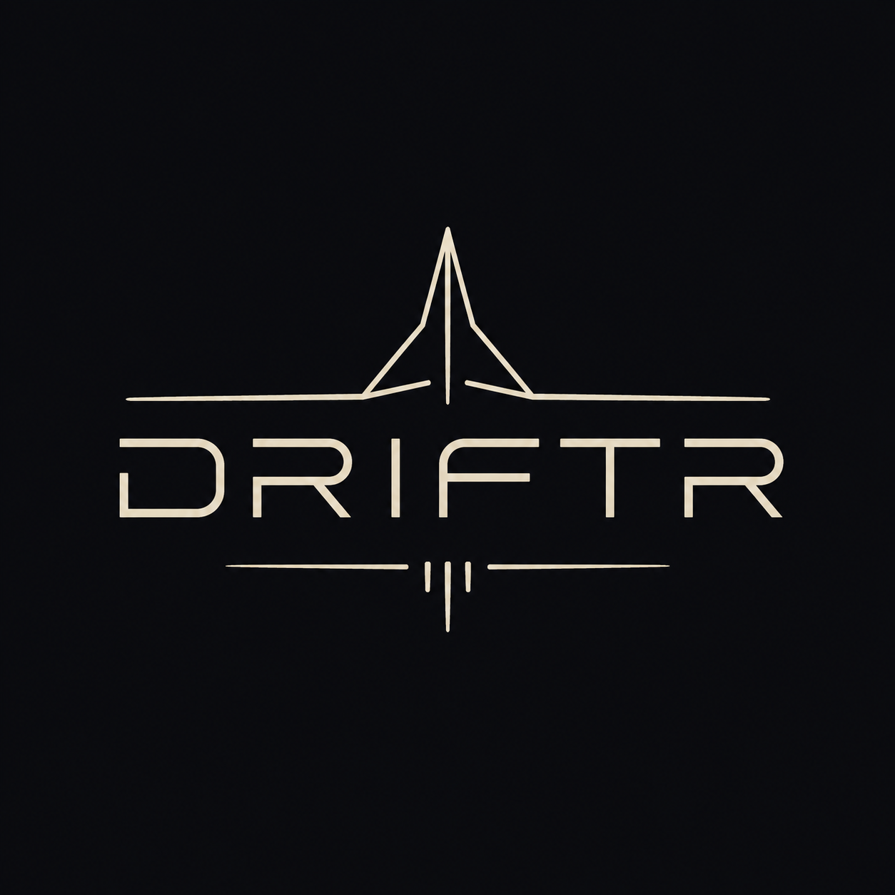
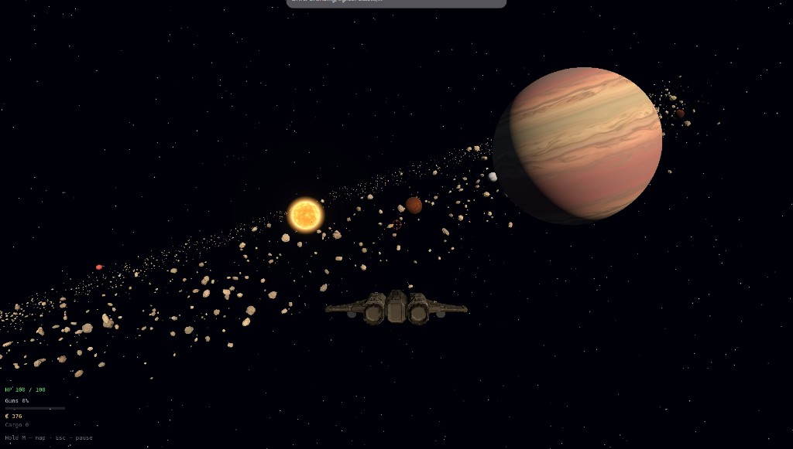
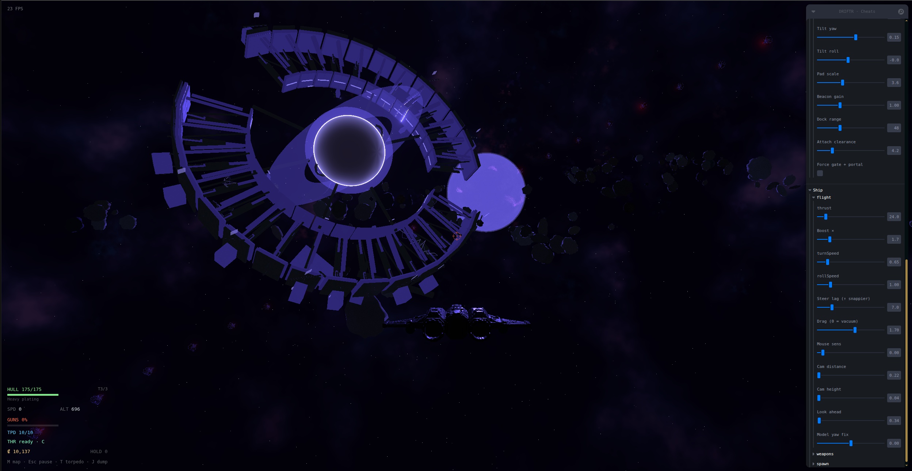

<p align="center">
  
</p>

<p align="center">
  Pilot a ship through a compressed Sol system — mine the belt, trade at orbital stations, and fight bandits in the dark.
</p>

<p align="center">
  <a href="https://berrytechnics.github.io/driftr/"><strong>Play online →</strong></a>
</p>

<p align="center">
  
</p>

<p align="center">
  
</p>

Browser space-flight game built with React, Three.js, and React Three Fiber. Installable as a PWA. Pushes to `main` deploy to GitHub Pages.

## Play locally

```bash
npm install
npm run dev
```

Open the URL Vite prints (usually `http://localhost:5173`). After the boot splash, a lore briefing appears on first visit (dismiss with **Continue**; pre-checked **Don't show next time** persists). Then click **Engage / Launch** to capture the pointer and fly.

```bash
npm run build    # production build → dist/ (base path /driftr/)
npm run preview  # serve the build locally (use this to test the PWA)
```

## Controls

| Input | Action |
| --- | --- |
| Mouse / arrows | Steer |
| `W` / `S` | Thrust / brake |
| `Shift` | Boost |
| `Q` / `E` | Roll |
| LMB / `F` | Fire cannons |
| `T` | Torpedo (locks nearest foe ahead; requires station unlock) |
| `C` | Advanced thruster — toggle ballistic cruise (requires unlock; blocked in combat) |
| `J` | Jettison cargo (bandits race you for it) |
| Hold `M` | System map (release to close; drag to orbit, scroll to zoom; click a body to mark a waypoint) |
| `F` (near a station) | Dock |
| `Esc` | Pause / resume (also closes the map) |

Music and SFX volume live under the control map in the start / pause menu and persist across sessions. The pause MFD also keeps a **Signal Journal · Nyx** that fills as you recover outer-system leads. **Enable cheat menu** (same menus) opens the admin panel for sky hops (Sol ↔ Vesper, plus a direct hop into the gate void), warps, grant cheats, and Vesper siphon / gate tools for the rest of the tab session. **Reset progress** (same menus, confirm to wipe) clears credits, cargo, upgrades, lore, and hull back to a fresh run — needed because clearing `localStorage` while the tab is open gets overwritten by autosave / unload.

Flight HUD includes a bottom-right **navball** (ecliptic horizon, pitch ladder, heading, and sun / prograde markers) plus an optional **map waypoint** diamond / edge chevron when you mark a body on the chart.

### Advanced thruster (`C`)

Buy the mod at any station Services desk. While lit you burn straight ahead at high speed: steering and weapons lock out, and NPC map contacts blank. Toggle it off with `C` again. You cannot light it while in combat.

### Dock vs fire (`F`)

Near a station berth, `F` docks. Elsewhere (and with LMB) it fires the cannons.

## The system

Named bodies orbit Sol: Hermes, Ares, Boreas, Thalassa, Kronos, Ouranos, and the distant elliptical dwarf **Nyx**, plus moons and orbital stations. Orbits tilt slightly off the ecliptic; moons and stations drift slowly around their hosts. Soft nebula gas hangs in the lanes. The dense asteroid belt sits outside Thalassa (~2000 from Sol). Hold `M` for a live **3D system map** — drag to orbit, scroll to zoom, click a star / planet / moon / station to set a flight waypoint — with your ship, planet/moon paths, unlabeled station rings, contacts, and Nyx’s stretched ellipse.

Three outposts share the same economy and outfitters:

| Station | Orbit |
| --- | --- |
| **Thalassa Station** | Above the habitable world by the belt |
| **Ares Station** | Inner system, over Ares |
| **Kronos Station** | Outer gas giant berth |

A fourth berth — **Nyx Transit** — is not on the dwarf. It waits empty at Nyx’s farthest turn (apoapsis; see below).

Stock sensors show contacts within a modest radius; the **long-range sensors** upgrade extends map beacons (hostiles and patrols read farther into the black). During an advanced-thruster burn, NPC contacts blank so the map goes quiet.

### Nyx Transit

Life on the Sol lane is familiar work: haul from the belt, sell at the stations, stay alive between berths. Bandits hunt the haul; patrols keep the route honest enough. Outfit the hull and the black between stops gets shorter — or quieter.

Farther out, Nyx refuses to behave. When the dwarf was first charted, surveyors assumed a simple orbit and raised **Nyx Transit** to meet her. They did not know the ellipse. At apoapsis Nyx ran beyond any craft of that age; help could not follow. When Nyx finally swung home, nothing waited in her sky — and the pad was never on the dwarf itself. Only ghosts remain: a struck transit board on some docks, a corrupt comlog, and rumors of a berth parked at the farthest turn of her path.

Pilots who push the outer lanes can piece the story together:

1. **Clues** — charcoal **Nyx dust** in the belt, a COM intercept at dock, or simply arriving at Nyx and finding no station unlocks **Ask about Nyx** on station ATC (each pad has its own portrait feed).
2. **Kronos** — only Kronos ATC has anything useful: an old dockmaster’s private watch on **Hyperion**.
3. **Hyperion → apo** — near Hyperion you recover the apoapsis mark; the map tags **APO · TRANSIT** on Nyx’s ellipse.
4. **Ghost pad** — fly the apoapsis. The derelict appears as a translucent berth. **Nyx dust** wakes it into a hard dock — each Transit docking spends a shard and can slip you into another sky.

### Vesper

Dust-keyed Transit docks can drop you under a small indigo star — **Vesper** — a compact, quieter chart (catalog worlds **V-1**–**V-3**, an ashen **Nyx**, sparse belt, denser nebula). A live **Nyx Station** orbits the dwarf here with limited services (cargo sell + hull repair; outfit desks are dark). Farther out, a cold **derelict tug** holds a recovered crew log, a silent **probe husk** marks the black, and a tilted **Misplanted Gate** — an empty survey ring you can thread — waits between Nyx and V-3.

Outside every catalog orbit hangs a dense **satellite ring** of alien siphons. Present pads are dockable berths (`Siphon 00`…): live nodes already hum, while a few dormant ones take **Nyx dust** to revive. Repair every dark siphon and the gate wakes — lattice brightens, arcs crackle between the struts, and a dark portal spheres in the throat. The aperture is damaged and unsteady: it flickers and throws short ripples, a reminder the ring was never meant to sit here. Fly the powered throat and you slip into a liminal void with a matching gate — return the same way. Dock Nyx Station with dust aboard to spend another shard and hop skies again. Which system you are in (and which siphons you’ve repaired) survives reload; map waypoints clear on transport.

Recovered leads also land in the pause-menu **Signal Journal**. The first-load briefing tells the vanishing story; **Reset progress** clears the “don’t show again” flag (and all lore flags) so it can return.

## Loop

1. **Mine** — blast asteroids for rock ore (dusty brown-gray), volatile ice (pale ash), and rare alloy (warmer gray). Rock color marks the primary haul; drops favor that material with a small chance of the others. Shards magnet toward your hull when you get close. Occasional speed and fire-rate buff pickups spawn too.
2. **Fight** — bandits hunt the belt; patrols keep their own routes. Hull HP, weapon heat / overheat, hit flash, and off-screen chevrons keep combat readable. Soft additive explosions mark lethal hits. Jettison cargo with `J` to bait scavengers; die and you dump cargo (credits stay).
3. **Dock** — approach any station and press `F`. Sell cargo, repair, buy armor / ordnance / cruise and sensor mods, then undock. With Nyx dust aboard you can also hard-dock the apo ghost pad — and slip into Vesper.
4. **Save** — credits, cargo, hull, heat, armor, thruster, sensors, torpedoes (including magazine tier), buffs, active system (Sol / Vesper / gate void), lore progress (journal leads, Transit state, alt wrecks, Vesper siphon repairs), and dock state autosave to `localStorage`. Use **Reset progress** on the start / pause menu for a clean wipe (DevTools clear alone is not reliable while the game is loaded).

## Station outfitters

Every Sol station Services desk offers the same catalog:

| Outfit | What it does |
| --- | --- |
| Hull repair | Pay per missing hit point for a full bay restore |
| Armor plating (3 tiers) | Raises max hull through 125 → 150 → 175 |
| Seeking torpedoes | Unlock tubes + magazine; buy reloads to refill |
| Torpedo magazine (3 tiers) | Raises tube capacity through 6 → 8 → 10 |
| Advanced thruster | Ballistic cruise on `C` (see above) |
| Long-range sensors | Longer map contact range and brighter NPC beacons |

Cargo desk sells ore, ice, and alloy for credits. **Nyx Station** in Vesper only offers cargo sell and hull repair.

## Features

- Boot splash that tracks asset load before the start menu
- First-load lore briefing (Sol lane life and the Nyx Transit vanishing)
- Flight model with thrusters, boost, mouse aiming, roll, and turn inertia
- Navball attitude HUD and click-to-mark map waypoints with on-screen / edge tracking
- Loot magnet that pulls nearby shards and buffs into scoop range
- Color-coded asteroid types (ore / ice / alloy) so you can hunt a specific haul
- Procedural asteroid belt (shader rock detail, mining, and loot)
- Soft nebula volumes in Sol and denser wisps under Vesper
- Multi-station world (Thalassa, Ares, Kronos) with shared shops and ATC portraits
- Interactive 3D system map (hold `M`) with inclined orbits, station rings, and remembered camera
- Bandit AI, seeking torpedoes, combat HUD, and layered ship-explosion VFX
- Cargo jettison bait that pulls bandits off your trail
- Advanced thruster cruise and sensor upgrades from the station
- Nyx questline — Ask ATC, Hyperion lead, apo ghost pad, dust-keyed hard dock, pause journal
- Dust-gated sky hop into Vesper (Nyx Station, derelict tug log, probe husk, Misplanted Gate, satellite siphon ring)
- Siphon berths you can repair with Nyx dust — full ring powers the gate’s unstable portal and charge arcs
- Fly the powered gate throat into a liminal void pocket (matching ring; return hop through the same aperture)
- Theme music in flight, station ambience when docked, separate volume sliders
- Reset progress control on the start / pause menu (confirmed wipe of the local save)
- Installable PWA with offline-ready assets (service worker on production builds)
- Optional cheat / admin panel from the start / pause menu (sky hops including gate void, warps, grant outfits, siphon / gate cheats)
- Leva world-tuning folders in the same panel while cheats are open (Env · Vesper includes siphon ring controls; Env · Void tunes the liminal pocket)

## Stack

- [React](https://react.dev) + [Vite](https://vite.dev)
- [Three.js](https://threejs.org) via [React Three Fiber](https://docs.pmnd.rs/react-three-fiber) / [Drei](https://github.com/pmnd.rs/drei)
- [Leva](https://github.com/pmnd.rs/leva) for debug controls
- [vite-plugin-pwa](https://vite-pwa-org.netlify.app/) for install / offline support
